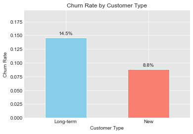
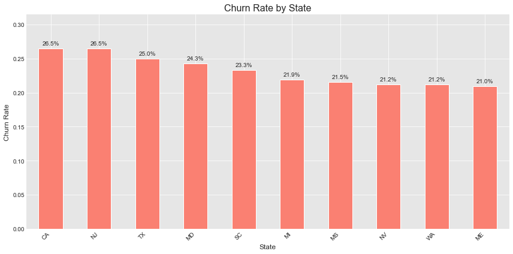
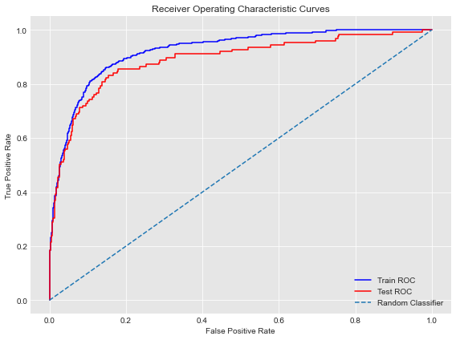
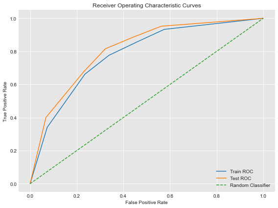

# **Churn Analysis and Predictive Modeling using Machine Learning**

## **Project Overview**
This Project analyses customer's unsubscription from SyriaTel's Telecom and also does predictive modeling by examining various factors e.g. state, account length, number of voice mail messages and many others

## **Business Understanding**
Customer churn is a major challenge for SyriaTel's Telecom company, as acquiring new customers is significantly more expensive than retaining existing ones. The company has observed a steady increase in customer attrition, which directly impacts revenue, customer lifetime value, and market competitiveness

## **Goals**
- **1. To Determine whether state is a factor affecting churning.**
- **2. To find out which state has the highest churn.**
- **3. To determine whether new customers churn faster than long-term customers.**
- **4. To determine which feature strongly drives churning.**
- **5. To determine the best-performing machine learning model for predicting SyriaTel telecom customer churn.**

## **Dataset**
The dataset used for analysis and prections [data](https://www.kaggle.com/datasets/becksddf/churn-in-telecoms-dataset) was gotten from kaggle updated 8 years ago

### **Data Preprocessing**
- The data was clean i.e. no missing values and no duplicates

### **Analytical Approach**
- **Descriptive Statistics** -- Calculated mean churn by state, new and customers
- **Correlation Analysis** -- Examined and removed highly correlated features
- **Hypothesis Testing:**
	- T-test to compare the mean account length of those who churn and those who don't
	- Chi-Square test to check for association between churn and state
## **Visualization** -- Created bar plots to give insights and also ROC curve for the optimal model

## Modeling

I formulated the churn problem as a binary classification task.
Several models were evaluated, including:

- Logistic Regression (baseline)
- Decision Tree Classifier

Hyperparameter tuning was performed on the Decision Tree to control
overfitting, focusing on:
- max_depth
- min_samples_split
- max_features
- max_sample_leafs

The final model was selected based on validation AUC score and model interpretability.

## Evaluation

Model performance was evaluated using **ROC curve and Area Under the Curve**, as the target, churn, 
had class imbalance and AUC captures ranking performance.

The final Logistic Regression model achieved:
- **Train ROC AUC:** 0.92
- **Test ROC AUC:** 0.89

The final Decision Tree achieved:
- **Train ROC AUC:** 0.78
- **Test ROC AUC:** 0.81

The logistic regression model demonstrates good discriminatory performance, achieving an AUC of
92% on the training set and 89% on the test set. The comparable performance
across datasets indicates strong generalization and minimal overfitting.

The decision tree model demonstrates good discriminatory performance, achieving an AUC of
78% on the training set and 81% on the test set. The comparable performance
across datasets indicates strong generalization and minimal overfitting.

## Findings
- On average, 26 out of 100 customers churn in California and New Jersey.
- To the contrary, old customers seem to churn more fater than new customers.
- Customers subscribed to an international plan are at the highest risk (12.76 times) of churn.
- The odds of churn of a customer with a voice mail plan reduces by about 84% compared to a person without.
- State is also a factor affecting churn rate.

## Conclusion

The analysis shows that customer churn can be predicted with reasonable
accuracy using state, account length and service features like total eve minutes on a call etc.

The model enables the business to:
- Identify the strongest driver of churning, international plan.
- Target retention efforts more effectively
- Reduce customer acquisition costs

However, the model is limited by the size of the dataset and the use of
a single classifier. Future work will explore ensemble methods such as
Random Forests.

## Recommendations

1. **Re-evaluate the international plan offering**
   Customers subscribed to the international plan show the highest churn risk.
   The company should review pricing, billing transparency, and perceived value
   of this plan to address potential dissatisfaction.

2. **Target international plan users with retention incentives**
   Proactively offer discounted international rates, bundled packages, or
   loyalty rewards to customers on international plans before churn occurs.

3. **Promote and expand voice mail plan adoption**
   Customers with voice mail plan have substantially lower churn risk.
   The company should actively encourage adoption through onboarding prompts,
   bundled offers, or default inclusion in service plans.
   
4. **Prioritize retention efforts in high-churn states**
   New Jersey and California should be treated as priority regions for churn
   mitigation, with targeted retention campaigns and enhanced customer support.